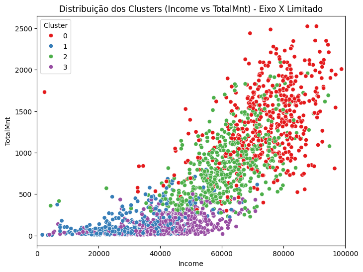

# Customer Segmentation Project

Este repositório contém um projeto de segmentação de clientes usando dados de campanhas de marketing. O objetivo é identificar diferentes grupos de clientes para orientar estratégias de marketing e anúncios personalizados.

## Estrutura de Arquivos

- **CostumerSegmenation.ipynb**  
  Notebook principal que realiza:
  1. Carregamento e limpeza dos dados.
  2. Feature engineering (criação de variáveis relevantes).
  3. Aplicação de algoritmo de clusterização (ex.: K-Means).
  4. Análise dos resultados e criação de insights de negócio.

- **README.md**  
  Este arquivo de documentação.

## Como Executar

1. Clone ou baixe este repositório.
2. Abra o arquivo `CostumerSegmenation.ipynb` em um ambiente Jupyter Notebook ou Google Colab.
3. Instale as dependências listadas abaixo (caso ainda não tenha instalado).
4. Execute as células em sequência para reproduzir as análises.

## Dependências

- Python 3.x
- NumPy
- Pandas
- Matplotlib
- Seaborn
- scikit-learn

Instale usando:
```bash
pip install numpy pandas matplotlib seaborn scikit-learn
```
## Distribuição dos Clusters




## Análise Detalhada dos Clusters

A seguir, apresentamos uma **interpretação resumida** de cada cluster, baseada em variáveis como **Income**, **TotalMnt**, **idade**, **recência** de compras e outros fatores relevantes:

---

### Cluster 0 (vermelho) – “High Spenders”
- **Gasto total**: Alto (ex.: média de 1500).  
- **Renda**: Variada (há clientes de renda média a alta).  
- **Possível Perfil**: Consumidores que podem priorizar certos produtos e aceitar bem campanhas premium.  
- **Estratégia de Marketing**: Oferecer produtos de alto valor agregado, além de programas de fidelidade exclusivos e experiências diferenciadas.

---

### Cluster 1 (verde) – “Mid-Level Spenders”
- **Gasto total**: Médio (ex.: média de 600–800).  
- **Renda**: Geralmente média, com hábitos de compra equilibrados.  
- **Possível Perfil**: Público com potencial para **upsell** ou **cross-sell**, pois possuem renda e engajamento medianos.  
- **Estratégia de Marketing**: Destacar ofertas que equilibrem custo-benefício, incentivando um aumento de ticket médio ou a experimentação de novas categorias de produtos.

---

### Cluster 2 (azul) – “Lower Spend, Medium Income”
- **Gasto total**: Abaixo do cluster verde, mas não o menor.  
- **Renda**: Média, porém o gasto efetivo é relativamente baixo (talvez sejam indiferentes a promoções ou comprem itens específicos).  
- **Possível Perfil**: Compradores mais seletivos ou pouco fiéis, com potencial não explorado.  
- **Estratégia de Marketing**: Criar promoções segmentadas para aumentar a frequência de compras ou incentivar o consumo em categorias não exploradas.

---

### Cluster 3 (roxo) – “Low Spenders / Baixo Engajamento”
- **Gasto total**: Baixo, mesmo que a renda possa não ser tão baixa.  
- **Possível Perfil**: Clientes pouco fidelizados, que realizam compras pontuais ou apenas básicas.  
- **Estratégia de Marketing**: Investir em campanhas de reativação e descontos iniciais para atrair o cliente a comprar com mais frequência, reduzindo barreiras de entrada.

---


